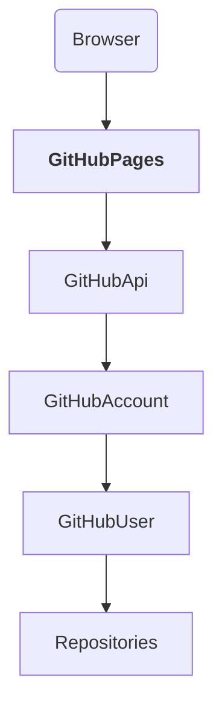
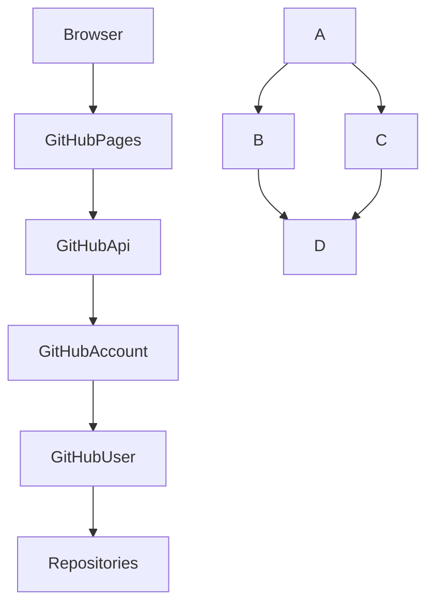
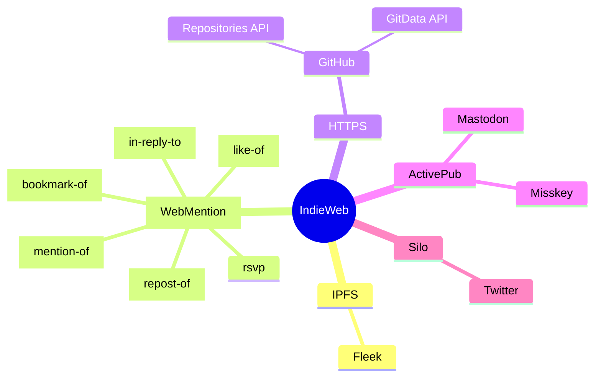
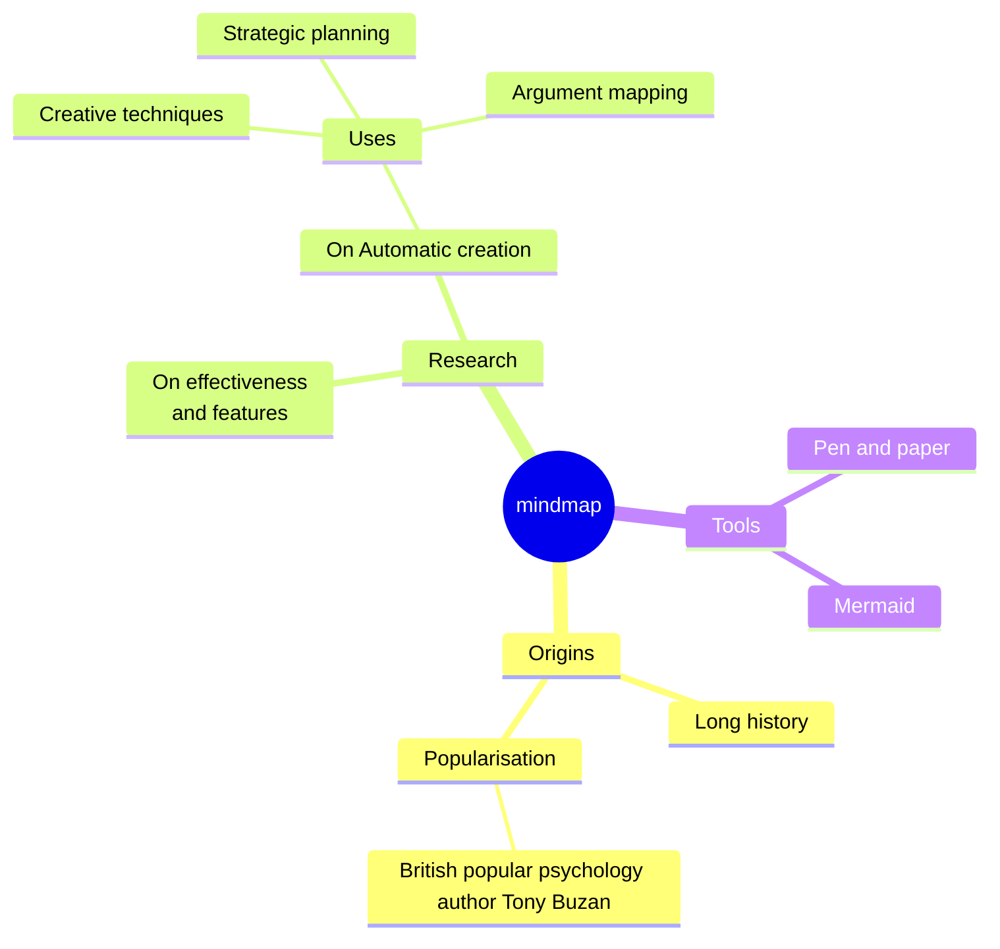
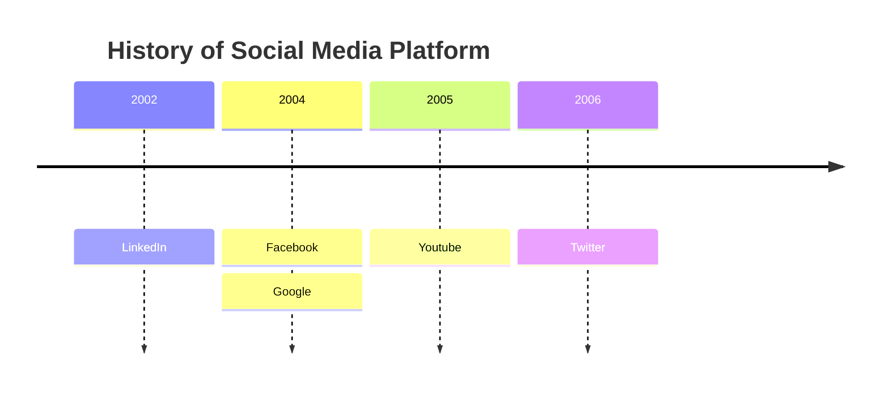

# GitHubリポジトリを作成する

<section><h1>引数</h1>
<form>
<fieldset><legend>必須</legend>
<label><input type="text" id="access_token" required></label>
<label><input type="text" id="name" required maxlength="100"></label>
</fieldset>
<fieldset><legend>任意</legend>
	<fieldset><legend></legend>
	<label><input type="text" id="description"></label>
	<label><input type="text" id="homepage"></label>
	<label><input type="checkbox" id="private"></label>
	</fieldset>
	<fieldset><legend></legend>
	<label><input type="checkbox" id="auto_init"></label>
	<label><input type="text" id="gitignore_template"></label>
	<label><input type="text" id="license_template"></label>
	</fieldset>
	<fieldset><legend></legend>
	<label><input type="checkbox" id="has_issues" checked></label>
	<label><input type="checkbox" id="has_projects" checked></label>
	<label><input type="checkbox" id="has_wiki" checked></label>
	<label><input type="checkbox" id="has_discussions"></label>
	<label><input type="checkbox" id="has_downloads" checked></label>
	</fieldset>
	<fieldset><legend></legend>
	<label><input type="checkbox" id="is_template"></label>
	<label><input type="text" id="team_id"></label>
	</fieldset>
	<fieldset><legend></legend>
	<label><input type="checkbox" id="allow_squash_merge" checked></label>
	<label><input type="checkbox" id="allow_merge_commit" checked></label>
	<label><input type="checkbox" id="allow_rebase_merge" checked></label>
	<label><input type="checkbox" id="allow_auto_merge"></label>
	<label><input type="checkbox" id="delete_branch_on_merge"></label>
	<label><input type="checkbox" id="allow_squash_merge" checked></label>
	<label><select id="squash_merge_commit_title"><option></option><option value="PR_TITLE"></option><option value="COMMIT_OR_PR_TITLE"></option></select></label>
	<label><select id="squash_merge_commit_message"><option></option><option value="PR_BODY"></option><option value="COMMIT_MESSAGES"></option><option value="BLANK"></option></select></label>
	<label><select id="merge_commit_title"><option></option><option value="PR_TITLE"></option><option value="MERGE_MESSAGE"></option></select></label>
	<label><select id="merge_commit_message"><option></option><option value="PR_BODY"></option><option value="PR_TITLE"></option><option value="BLANK"></option></select></label>
	</fieldset>
</fieldset>
<button type="button" id="create">リポジトリを作る</button>
</form>
</section>

<section id="result"><h1>結果</h1>
<div id="result-link"><a id="owner-link" href=""></a><span id="owner-repo-split" style="visibility:hidden;">/</span><a id="repository-link" href=""></a></div>
<div style="display: flex; gap: 0px 1em;"><div id="http-status-code"></div><div id="http-status-text"></div></div>
<textarea  id="response"></textarea>
</section>

<div style="display: flex;">
<section><h1>情報源</h1>

* [GitHub API Repositories Create]
	* `gitignore_template`: [GitHub gitignore][]
	* `license_template`: [GitHub license][]

[GitHub API Repositories Create]:https://docs.github.com/ja/rest/repos/repos?apiVersion=2022-11-28#create-a-repository-for-the-authenticated-user
[GitHub gitignore]:https://github.com/github/gitignore
[GitHub license]:https://github.com/github/choosealicense.com/tree/gh-pages/_licenses

</section>
<section><h1>課題</h1>

* [GitHubのGit Data APIでコミットを作成する][]
* [octokit.js][]

[GitHubのGit Data APIでコミットを作成する]:https://int128.hatenablog.com/entry/2017/09/05/161641
[octokit.js]:https://github.com/octokit/octokit.js/

</section>
</div>

## diaglam









<!--

    W[WebMention]
    W[<a href="https://github.com/aaronpk/webmention.io#api">WebMention<a>]

  click W "https://github.com/aaronpk/webmention.io#api"

    I[IPFS]
  click I https://ipfs-book.decentralized-web.jp/what_is_ipfs/
-->






<style> 
.markmap > svg {
width: 100%; 
height: 300px;
}
</style>
<!--
-->
<!--
<div class="markmap">
# markmap
## べんり
## きれい
## はやい
</div>
-->

```markmap
# markmap
## べんり
## きれい
## はやい
* スゲー
```

<!--
<script src="https://cdn.jsdelivr.net/npm/markmap-autoloader"></script>
<div class="markmap">
# markmap
## べんり
## きれい
## はやい
</div>
-->

```markmap
# [IndieWeb](https://www.cotan-en.com/blogs/news/the-indieweb-movement)
## [IPFS](https://ipfs-book.decentralized-web.jp/what_is_ipfs/)
### [Fleek](https://fleek.co/)
## HTTPS
### [WebMention](https://webmention.io/)
#### in-reply-to
#### like-of
#### repost-of
#### bookmark-of
#### mention-of
#### rsvp
### [ActivePub](https://ja.wikipedia.org/wiki/ActivityPub)
#### Mastodon
#### Misskey
### Silo
#### [GitHub](https://github.co.jp/)
##### [Repositories API](https://docs.github.com/ja/rest/repos)
##### [GitData API](https://int128.hatenablog.com/entry/2017/09/05/161641)
##### [octokit.js](https://github.com/octokit/octokit.js/)
#### Twitter
#### FaceBook
#### YouTube
#### Hatena
```

